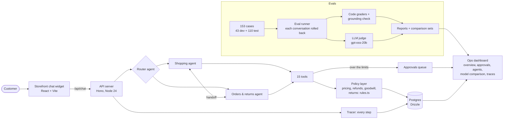

# AgentDesk

**A team of AI agents that runs a store's customer chat, built, measured, and managed like a real system.**

AgentDesk answers customers of **Larchgrove Supply Co.**, a fictional outdoor-gear store:
- **A router** sends each conversation to a **shopping agent** (products, stock, prices, coupons) or an **orders & returns agent** (tracking, refunds, damaged items), and the two hand off to each other.
- **Business rules are enforced in code, never only in the prompt.** Prices come only from a pricing tool; refunds over $50 wait for a human; customers see only their own orders.
- **Every conversation is traced.** The same agents are evaluated on a held-out test set across three models, and an ops dashboard shows the results, the approvals queue and the team.

The agent loop is hand-written TypeScript (no agent framework). Every product, customer and order is fictional.

## Architecture



- **Models are configuration** (`server/config/models.json`, `team.json`): Gemini 3.5 Flash-Lite (free tier), and gpt-oss-120b and Qwen3.8-27B on Groq. All go through one OpenAI-compatible client, and tests use a scripted fake provider, never a real API.
- **"Now" is an injected clock**, money is integer cents, and tools return `{ ok, data } | { ok: false, error }` instead of throwing.
- **Business limits live in one file** (`server/src/policy/rules.ts`). The policy text the agents read is generated from the same constants, so it can't promise something the code won't do.

## Results: the held-out test set

110 test cases, never used for tuning, judged by gpt-oss-20b (`rubric@4`). Rates show 95% Wilson intervals. Two runs:
- **`test-1`** (2026-10-05): all three models, before the fixes below.
- **`test-2`** (2026-10-06): Flash-Lite and gpt-oss-120b after round 3 (the damage-cause rule, the item guard, and catching tool calls written out as text). Qwen wasn't rerun: it was already retired from the shopping role, and the Groq budget was nearly spent. Its column is from `test-1`.

Every number comes from [`test-2/report.md`](server/eval-results/runs/test-2/report.md) and [`test-1/report.md`](server/eval-results/runs/test-1/report.md), re-graded with the current grader (no model calls).

| | Flash-Lite `test-2` | Flash-Lite `test-1` | gpt-oss-120b `test-2` | gpt-oss-120b `test-1` | Qwen3.8-27B `test-1` |
| --- | --- | --- | --- | --- | --- |
| **Task success** | **78%** (85/109, 69–85%) | 72% (78/109, 62–79%) | **63%** (69/110, 53–71%) | 72% (79/110, 63–79%) | 65% (71/109, 56–73%) |
| Shopping / support cases | 80% / 75% | 78% / 65% | 71% / 55% | 83% / 63% | 59% / 67% |
| Routing accuracy | 96% | 96% | 99% | 99% | 94% |
| **Policy violations** (target 0) | 0 | 1 | 0 | 2 | 0 |
| Conversations with an invented fact | 2% (1–6%) | 2% (1–6%) | 4% (1–9%) | 2% (1–6%) | 4% (1–9%) |
| Reply time per turn, p50 / p95 | 4.2 s / 7.0 s ¹ | 4.4 s / 24.4 s ¹ | 5.4 s / 10.5 s | 3.5 s / 8.4 s | 2.6 s / 5.1 s |
| Cost for 110 conversations | $0.37 (paid tier) | $0.00 (free tier) | $0.15 | $0.14 | $0.96 |

¹ Flash-Lite ran on Gemini's free tier for `test-1` and the paid tier for `test-2`, so its reply times aren't comparable between the two runs.

**What the comparison says.** The comparison only highlights a model with zero policy violations, and only calls it a winner if its interval clears the runner-up's.
- **`test-2`: Flash-Lite leads, not significantly.** Its interval (69–85%) overlaps gpt-oss-120b's (53–71%).
- **`test-1`: Qwen is the only model without a policy violation, but don't read that as best.** Its task success is the lowest, and its one violation was reclassified (below). Flash-Lite's and gpt-oss's remaining `test-1` violations are headlamp refunds (dropped, or failed after a trip) that round 3 fixed.
- **The moves between runs are within run-to-run variation.** In two identical dev runs, gpt-oss scored 75% and 62%, and Flash-Lite 85% and 78%. So neither Flash-Lite's +6 nor gpt-oss's −9 can be credited to round 3.

**Two grading decisions (2026-10-06), applied to every saved run with no model calls:**
- **Refunds are graded per order**, by total and reason. Two `test-2` conversations refunded exactly the right amount in two parts and had counted as violations.
- **A coupon lowered from what the customer asked is a failed task, not a policy violation.** The customer asked for 25% on a lost order; both models (and Qwen in `test-1`) issued 10% instead of requesting 25%. The 10% stayed within every limit enforced in code; the rule to pass on the customer's amount lived only in the grader. The case still fails. The coupon tool's description now tells agents to request the customer's amount, **not yet measured**.
- What changed: policy violations, `test-2` Flash-Lite 2 → 0 and gpt-oss 2 → 0; `test-1` Qwen 1 → 0. Task success didn't change for any model. Before these decisions, both test runs had no winner.

**What round 3 changed, where it can be measured:**
- **Headlamps that were dropped or failed after use, refunded as "damaged":** 3 of 4 such test conversations in `test-1`, **0 of 4 in `test-2`**.
- **Flash-Lite guessing which item broke:** on the dev case built for it, it guessed 3 of 3 times before. After, it asked on its own 2 of 3 times, and the guard refused the third guess, after which it asked. The guard never needed to fire on the test set.

**The judge was checked against a human:** on 30 blindly graded replies (dev set, an earlier rubric version), its yes/no answers agreed with the human grader 95% of the time (77/81, 88–98%).

### Known weaknesses (shown, not hidden)
- **Held-out scores are lower than dev** (`test-1`): Flash-Lite 85% → 72%, gpt-oss-120b 76% → 72%, Qwen 68% → 65%. The dev numbers are optimistic because prompts were tuned on them.
- **The damage cause is still the model's word.** gpt-oss-120b once refunded a headlamp that stopped working after a few hikes as "arrived damaged" (1 of 12 dev tries; Flash-Lite 0 of 12). The $50 limit still bounds it.
- **Coupon requests get lowered** (above). The fix is a sentence in the tool description, not measured yet.
- **gpt-oss-120b promises follow-ups it can't do** ("I'll check back"): 5 of 110 conversations in `test-1`, 4 in `test-2`. It also makes timing claims no tool supports (7 of 110 in `test-2`).
- **One Flash-Lite reply showed raw tool syntax** to the customer (`test-1`). The graders first missed it. Both checks now catch it.
- **The judge** (gpt-oss-20b) is from the same family as one of the agents, so its agreement is reported per agent model. It also scores bad replies too generously, so pass/fail comes from the checks, not the quality scores.
- **Qwen wasn't re-measured after round 3.**

## Run it locally

You need **Node 24+** and **Postgres** (Postgres.app works; it connects as your Mac user).

```sh
npm install
cp .env.example .env            # fill in GEMINI_API_KEY (the free tier works); ADMIN_TOKEN for dashboard actions
createdb agentdesk_dev && createdb agentdesk_test
npm run db:migrate
npm run db:seed                 # the fictional store: 60 products, 200 customers, 400 orders
git config core.hooksPath .githooks   # pre-commit: typecheck + tests
npm run dev                     # API + web; Ctrl-C stops both
```

- **Storefront with the chat widget:** http://localhost:5180. Pick a demo customer, then chat. The agents only see that customer's orders.
- **Ops dashboard:** http://localhost:5180/ops/
  - **Overview:** results, the team, the switch/retire decision, safety examples linked to real traces.
  - **Approvals:** the human queue.
  - **Agents:** switch, retire or reinstate a model per role, with a reason and history.
  - **Model comparison** and **Runs:** traces, step by step.
- **Admin token:** reading is public. Approving, changing the team and viewing live conversations need `ADMIN_TOKEN` (24+ characters, e.g. `openssl rand -hex 24`).

| Command | What it does |
| --- | --- |
| `npm test`, `npm run typecheck` | All tests (fake model provider only) and types, server and web |
| `npm run chat -- --as maya.chen@example.com` | Chat in the terminal as a seeded customer |
| `npm run tool -- list` | Call a single tool by hand |
| `npm run trace -- <run id>` | Print a traced conversation |
| `npm run eval:run -- --name <run> --split dev --estimate-only` | Eval pipeline; always shows a cost estimate first |
| `npm run eval:report -- --name <run>`, `npm run eval:sets` | Re-grade a saved run (no model calls); rebuild the comparison |

## Documentation
- [`docs/PROJECT.md`](docs/PROJECT.md): the spec, and every change made to it.
- [`PROGRESS.md`](PROGRESS.md): current status, next steps and open items.
- [`CASE_STUDY.md`](CASE_STUDY.md): the story in about 800 words.
- [`docs/history/`](docs/history/): the detailed record per milestone, with every decision, number and fix ([M1](docs/history/M1.md) · [M2](docs/history/M2.md) · [M3](docs/history/M3.md) · [M4](docs/history/M4.md) · [M5](docs/history/M5.md) · [M6](docs/history/M6.md)).
- [`docs/JUDGE_RUBRIC.md`](docs/JUDGE_RUBRIC.md): how the LLM judge scores and why.
- [`docs/FREE_TIERS.md`](docs/FREE_TIERS.md): the models' limits and prices, and the spending caps (Groq $8 and Gemini $5 a month).
- The eval cases: `server/src/evals/cases/` (dev) and `server/src/evals/cases/test/` (held out).
